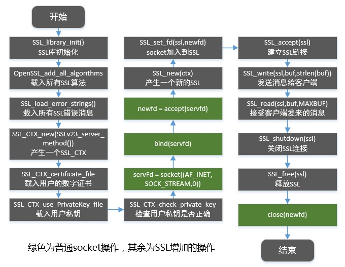

# Liso

* 实现了 HTTP/1.1 的 GET、POST、HEAD；
* 通过 OpenSSL 的 TLSv1.0 实现了 HTTPS；
* 实现了 CGI/1.1；

# OpenSSL

## 函数库



## 证书生成
生成 CA 证书：
```shell
# 生成私钥
openssl genrsa -out ca.key 2048 
# 生成证书请求
openssl req -new -key ca.key -out ca.csr
# 自签名得到证书
openssl x509 -req -days 365 -in ca.csr -signkey ca.key -out ca.crt
```
生成服务器证书：
```shell
# 生成私钥
openssl genrsa -des3 -out server.key 1024 
# 生成证书请求
openssl req -new -key server.key -out server.csr
# 通过 CA 颁发证书
openssl ca -in server.csr -out server.crt -cert ca.crt -keyfile ca.key 
```

# CGI

* CGI 通过标准输入从 server 获取用户请求，通过标准输出将请求结果返回给 server；
* CGI 创建时接受环境变量：
	* REQUEST_METHOD：请求方法，如 GET、POST；
	* QUERY_STRING：请求参数，URI 中 '?' 以后的；
	* HTTP_ACCEPT：客户端请求中的 Accept 请求头；
	* SERVER_PROTOCOL：HTTP 版本，如 HTTP/1.1；
	* GATEWAY_INTERFACE：CGI 版本，如 CGI/1.1；

# Docs

## 模块设计


* lisod：完成服务器初始化、执行事件循环、在事件循环中注册客户端连接事件、客户端读写事件；
* client：维护客户端信息；
* fdpool：维护文件描述符，提供事件注册接口（使用 select 实现）；
* http：提供请求读取、请求发送相关接口；
* cgi：提供 CGI 的创建与销毁接口；
* header：提供请求、响应首部相关接口；
* parse：提供接口用于解析字符流，并将其封装成请求首部；

## client
```c
typedef struct
{
	int cfd ;              // 客户端 fd
	SSL *ssl ;             // 客户端 fd 绑定的 SSL
	req_buffer req_buf ;   // 保存已接收的请求信息
	resp_buffer resp_buf ; // 保存等待发送的响应信息
	bool close ;           // 对端是否已单向关闭
} client ;

client *new_client (int cfd, SSL *ssl) ;
void free_client (client *cli) ;
```

## fdpool
```c
#define READ_FD 1  // 读事件
#define WRITE_FD 2 // 写事件

typedef struct
{
	void (*callback) (int fd, void *arg) ;
	void *arg ;                            // 回调时传入函数的参数
} fd_event ;

typedef struct
{
	int maxfd ;                // 维护的最大 fd，供 select 调用
	fd_set read_set ;          // 注册了读事件的 fd 集合
	fd_set write_set ;         // 注册了写事件的 fd 集合
	fd_set ready_read ;        // 传入 select，返回可读的 fd 集合
	fd_set ready_write ;       // 传入 select，返回可写的 fd 集合
	int fd[FD_SETSIZE] ;       // 维护所有 fd，以供在 fdpool_remove 重新计算 maxfd
	int n_fd ;                 // 所维护的 fd 总数
} fd_pool ;

// type 可以为 READ_FD 和 WRITE_FD 的位或
void fdpool_remove (fd_pool *fdp, int fd, int type) ;
void fdpool_add (fd_pool *fdp, int fd, int type, fd_event evt) ;
void fdpool_init (fd_pool *fdp) ;
void event_loop (fd_pool *fdp) ;
```

## cgi
```c
typedef struct
{
	int in ;   // 从 CGI 读数据的管道，标记为 -1 时表示已全部读完（对端关闭）
	int out ;  // 往 CGI 写数据的管道
} CGI ;

typedef struct
{
	char **envp ;   // 执行 CGI 时的环境变量
	int capacity ;  // envp 可用容量
	int size ;      // envp 中保存的环境变量个数
} CGI_envp ;

CGI *new_cgi (char *argv[], CGI_envp *cgi_envp) ;
void free_cgi (CGI *cgi) ;
CGI_envp *new_cgi_envp () ;
// 当 size 达到 capacity 时将 capacity 翻倍再 realloc，实现动态增长
int fill_cgi_envp (CGI_envp *cgi_envp, const char *name, const char *value) ;
void free_cgi_envp (CGI_envp *cgi_envp) ;
// 获得 URI 中 '?' 之后的部分，直接返回在 req_path 中的指针
char *get_cgi_query (char *req_path) ;
```

## header
```c
typedef struct
{
	char header_name[4096];  // 如 "Content-Length"
	char header_value[4096]; // 如 "100"
} Response_header;

typedef struct
{
	Response_header *headers;
	int header_count;     // headers 保存的响应头个数
	int header_capacity ; // headers 可用容量
} Response ;

typedef struct
{
	char header_name[4096];
	char header_value[4096];
} Request_header;

typedef struct
{
	char http_version[50]; // 如 "HTTP/1.1"
	char http_method[50];  // 如 "GET"
	char http_uri[4096];   // 如 "/index.html"
	Request_header *headers;
	int header_count;      // headers 保存的请求头个数
	int header_capacity ;  // headers 可用容量
} Request;

char *get_header (Request *req, char *name) ;
// Request 在 parse 中动态分配
void free_request (Request *req) ;
Response *new_response () ;
void free_response (Response *resp) ;
// 填充 Response.headers，当 size 达到 capacity 时将 capacity 翻倍再 realloc，实现动态增长
int fill_header (char *name, char *value, Response *resp) ;
```

## parse
```c
#define SUCCESS 0
#define BAD_REQ -1
#define REQ_UNFIN 1

// 在 [buffer, buffer + size) 中解析请求首部（Request 动态分配）
// offset: 请求首部在 buffer 中的截止位置
// ret = SUCCESS: 解析成功
// ret = BAD_REQ: buffer 中已有首部结束标志 '\r\n\r\n'，但首部格式不正确
// ret = REQ_UNFIN: buffer 中未检测到首部结束标志 '\r\n\r\n'，可能数据还未接收完全
Request *parse(char *buffer, int size, size_t *offset, int *ret) ;
```

## http
```c
typedef struct
{ // resp_buffer 存在待发送数据时（resp_buffer.buf 或 resp_buffer.resp_f）回调
	void (*callback) (void *arg) ;
	void *arg ;
} resp_event ;

typedef struct
{
	char *buf ;
	size_t size ;        // buf 已接收到的字节数
	off_t offset ;       // 往 CGI 写入时的偏移
	size_t capacity ;    // buf 可用容量
	Request *req ;       // 从 buf 解析出的请求首部，初始为 NULL
	size_t header_size ; // 请求首部在 buf 中为 [0, header_size)
	size_t body_size ;   // 请求体在 buf 中为 [header_size, header_size + body_size)
} req_buffer ;

typedef struct
{
	int fd ;             // 待发送的静态文件，初始为 -1
	off_t offset ;       // 已发送的偏移
	size_t size ;        // 文件总大小
} resp_file ;

typedef struct
{
	char *buf ;
	size_t size ;        // 待发送的总字节数
	off_t offset ;       // 已发送的偏移
	size_t capacity ;
	resp_file resp_f ;
	CGI *cgi ;           // 初始为 NULL
	resp_event evt ;
} resp_buffer ;

int init_req_buf (req_buffer *req_buf) ;
int init_resp_buf (resp_buffer *resp_buf) ;
void clr_req_buf (req_buffer *req_buf) ;
void clr_resp_buf (resp_buffer *resp_buf) ;
void free_req_buf (req_buffer *req_buf) ;
void free_resp_buf (resp_buffer *resp_buf) ;
int parse_req (req_buffer *req_buf) ;

int read_req (int fd, req_buffer *req_buf, SSL *ssl) ;
bool req_read_done (req_buffer *req_buf) ;
int send_resp (int fd, resp_buffer *resp_buf, SSL *ssl) ;
bool resp_send_done (resp_buffer *resp_buf) ;
bool resp_tobe_send (resp_buffer *resp_buf) ;
// 将请求码为 scode 的信息写入 resp，再将 resp 的内容按 HTTP 响应格式拷贝到 resp_buf.buf
void reply (int scode, Response *resp, resp_buffer *resp_buf) ;
```
* `handle_request`将请求分发给`handle_get`、`handle_post`、`handle_head`；
* `handle_get`将请求分发给`handle_static`、`handle_cgi`；
	* `handle_static`：将静态文件打开并将文件描述符保存到`resp_buffer.resp_f`；
	* `handle_cgi`：创建 CGI，因为没有请求体，将关闭`cgi.out`管道，将 CGI 的可读事件注册进 fdpool，用于将数据从 CGI 管道读入`resp_buffer.buf`，并调用`resp_event`通知上层；
* `handle_post`拒绝对静态文件的请求，CGI 除了注册可读事件，还向 fdpool 注册可写事件，用于将数据`req_buffer.buf`写入 CGI 管道；

## lisod
* 将`accept_client`作为监听端口的可读事件回调注册进 fdpool，用于`accept`客户端；
* 将`read_client`作为客户端可读事件回调注册进 fdpool，调用 http 读取、解析客户端请求，最后将请求传递给`handle_request`处理；
* 将`set_writeable`作为客户端的`resp_event`，在`resp_buffer`中存在待发送数据时，将`write_client`作为客户端可写事件注册进 fdpool，通过 http 将客户端`resp_buffer`中的待发送数据（`resp_buffer.buf`和`resp_buffer.resp_f`）发送给客户端，如果暂时没有待发送的数据就将可写事件从 fdpool 中注销，如果响应都发送完毕，则清空`req_buffer`和`resp_buffer`以等待下一次 HTTP 事务；